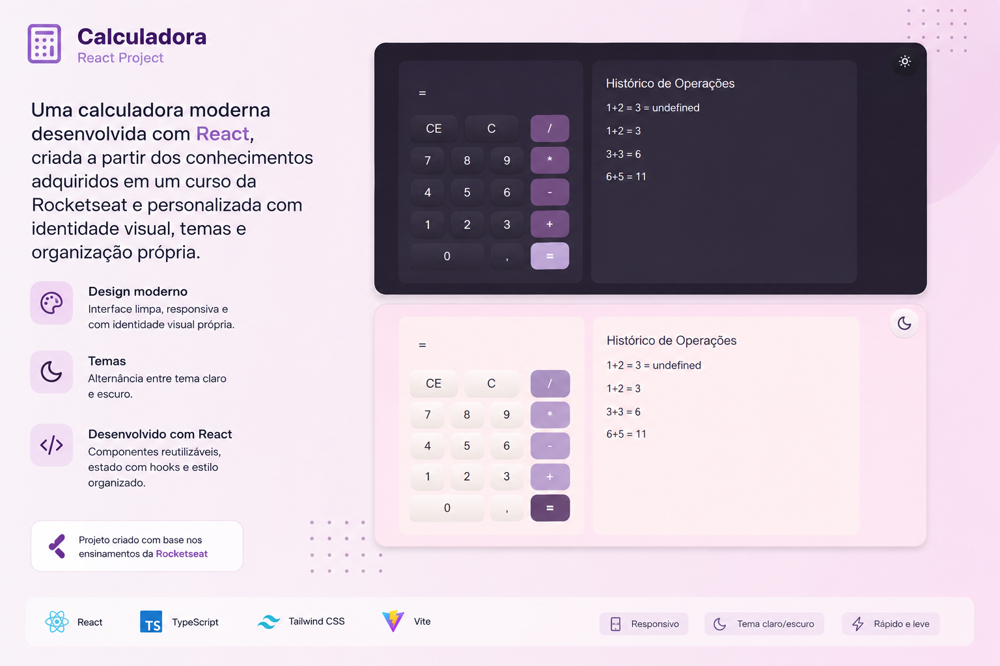

# 🧮 Calculadora

> Uma calculadora moderna desenvolvida com **React**, criada a partir dos conhecimentos adquiridos em um curso da **Rocketseat** e personalizada com identidade visual, temas e organização própria.

<p align="center">
  
</p>

## ✨ Sobre o projeto

A Calculadora é um projeto desenvolvido com o objetivo de praticar e consolidar conceitos fundamentais do ecossistema React.

A aplicação foi baseada no projeto de calculadora apresentado durante os estudos, mas recebeu **personalizações próprias**, tanto na interface quanto na estrutura do código.

Entre as principais alterações estão:

* 🎨 Nova paleta de cores
* ☀️ Tema **Light**
* 🌙 Tema **Dark**
* 🧩 Componentização da interface
* 📁 Organização do projeto em pastas
* ⚡ Utilização do **Vite**
* 📱 Interface responsiva
* ♻️ Reutilização de componentes e lógica

---

## 🎯 Objetivo

Este projeto faz parte da minha jornada de aprendizado em **React**, tendo como foco compreender não apenas como construir uma aplicação, mas também como organizar e estruturar um projeto de forma mais profissional.

Durante o desenvolvimento, foram colocados em prática conceitos como:

* Componentes
* Propriedades
* Estados
* JSX
* DOM e Virtual DOM
* Eventos
* React Hooks
* Renderização condicional
* Renderização de listas
* Filtragem
* Context API
* Ciclo de vida
* Hooks customizados

---

## 🛠️ Tecnologias utilizadas

<p align="center">


</p>

---

## 🚀 Funcionalidades

### 🧮 Calculadora

Realização de operações matemáticas através de uma interface simples e intuitiva.

### 🎨 Temas

A aplicação possui dois modos de visualização:

| ☀️ Light                | 🌙 Dark                        |
| ----------------------- | ------------------------------ |
| Interface clara e limpa | Interface escura e confortável |
| Paleta personalizada    | Paleta adaptada ao tema        |

O usuário pode alternar entre os temas diretamente pela interface.

### 🧩 Componentização

A interface foi dividida em componentes independentes, facilitando:

* manutenção;
* reutilização;
* organização;
* leitura do código;
* evolução da aplicação.

### 📁 Organização

O projeto foi estruturado de forma modular dentro do diretório `src`, separando componentes, estilos, hooks e demais responsabilidades da aplicação.

---

## 📂 Estrutura do projeto
src/
├── assets/
├── components/
│   ├── ...
├── context/
│   ├── ...
├── App.jsx
├── App.css
├── index.css
└── main.jsx

---

## 🧠 Conceitos praticados

Durante o desenvolvimento, foram explorados diferentes conceitos fundamentais do React:

### React
* Componentes
* Props
* Estados
* JSX
* Eventos
* Hooks
* Context API
* Ciclo de vida
* Renderização condicional
* Renderização de listas
* Hooks customizados

### JavaScript
* Manipulação de dados
* Funções
* Arrays
* Métodos de filtragem
* Eventos
* Lógica condicional

### Interface
* Responsividade
* Temas Light/Dark
* Organização visual
* Componentização

---

## 💡 Personalizações

Um dos objetivos deste projeto foi ir além da reprodução do conteúdo apresentado no curso.
Por isso, foram realizadas alterações próprias na aplicação.

### 🎨 Identidade visual
Foi criada uma nova paleta de cores para dar uma identidade diferente ao projeto original.

### ☀️🌙 Light & Dark Mode
Foi implementado um sistema de alternância entre os temas **Light** e **Dark**, permitindo que o usuário escolha sua preferência visual.

### 🗂️ Organização do código
Também foi aplicada uma estrutura de pastas e componentes com o objetivo de deixar o projeto mais organizado e facilitar futuras alterações.

---

## ⚙️ Como executar o projeto

### 1. Clone o repositório

```bash
git clone https://github.com/SEU-USUARIO/SEU-REPOSITORIO.git
```

### 2. Acesse a pasta

```bash
cd SEU-REPOSITORIO
```

### 3. Instale as dependências

```bash
npm install
```

### 4. Execute o projeto

```bash
npm run dev
```

A aplicação estará disponível no endereço indicado pelo Vite no terminal.

---

## 📚 Aprendizados

Este projeto foi importante para consolidar conhecimentos fundamentais sobre o funcionamento do React e compreender melhor como estruturar uma aplicação utilizando componentes reutilizáveis.
Além da implementação da calculadora, o projeto permitiu praticar conceitos como **gerenciamento de estado, Context API, hooks customizados, componentização e organização de código**.
Também foi uma oportunidade para experimentar decisões próprias de **UI/UX**, principalmente através da criação da paleta de cores e dos temas Light e Dark.

---

## 🔮 Próximos passos

Algumas melhorias que podem ser implementadas futuramente:

* [ ] Adicionar animações e transições
* [ ] Melhorar acessibilidade
* [ ] Adicionar testes automatizados
* [ ] Criar novas opções de personalização do tema
* [ ] Trazer mais opções de operações - Calculadora Cientifica

---

## 👩‍💻 Desenvolvido por
**Kayane Alebrante**

Projeto desenvolvido como parte da minha jornada de estudos em **desenvolvimento front-end e React**.

<p align="center">
  Feito com ☕, 💻 e muita vontade de aprender.
</p>
